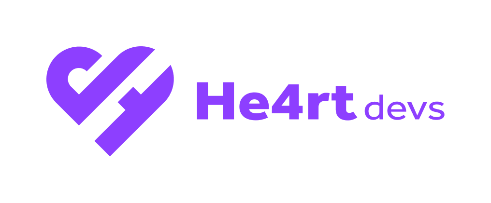

<!-- Title -->

<p align="center">
  
  <h2 align="center">He4rtoberfest 2023 (COMEÇA NO DIA 02/10/2023 AS 23:00)</h2>
</p>

 <!-- ABOUT THE PROJECT -->

## Sobre o Projeto

Sejam todos bem-vindos a terceira edição do He4rtoberfest, evento da He4rt Developers para incentivar novos desenvolvedores a participar do [Hacktoberfest](https://hacktoberfest.com/) pela DigitalOcean, ILLA Cloud e Appwrite, aprendendo um pouco mais sobre a ideia e filosofia do open-source.

A ideia da He4rt Developers sempre foi a inclusão de iniciantes na área, por isso, vamos focar em trazer essa inclusão para o Hacktoberfest! Se liga:

O objetivo é trazer exercícios (para entrega de resoluções em formatos de algoritmos), desde o mais simples até o mais completo, demonstrando as possibilidades de resolução das mais variadas formas em diversas linguagens de programassão, assim, disponibilizando uma biblioteca gigantesca de conteúdo para novos desenvolvedores, universitários e estudantes do geral. Para se inscrever e começar a contribuir não se esqueça de acessar o [portal oficial da MLH (Major League Hacking)](https://events.mlh.io/events/10423-he4rtoberfest-2023).

<!-- ROADMAP OF PROJECT -->

## Exercicios disponíveis

Na lista abaixo estarão todos os exercicios que iremos aceitar nas pull requests.

- [0 - Hello World (não irá contar)](./challenges/0-hello-world)
- [1 - Cubo Simples](./challenges/1-cubo-simples)
- [2 - Palíndromos](./challenges/2-palindromos)
- [3 - Conversão de Base](./challenges/3-conversao-de-base)
- [4 - Empréstimo](./challenges/4-emprestimo)
- [5 - Ordenar Letras](./challenges/5-ordenar-letras)
- [6 - Números Primos](./challenges/6-numeros-primos)
- [7 - Graus em Horas](./challenges/7-graus-em-horas)
- [8 - Pares de Letras](./challenges/8-pares-de-letras)
- [9 - Likes](./challenges/9-likes)
- [10 - Número Menor](./challenges/10-numero-menor)

Caso você queira dar sugestões de desafios, contate algum moderador no [Discord da He4rt](https://discord.gg/he4rt).

<!-- CONTRIBUTING -->

## Como participar

Contribuições fazem com que a comunidade open-source seja um lugar incrível para aprender, inspirar e criar, por isso, todas as contribuições são **extremamente apreciadas**!

Porém, como neste caso estamos falando de um evento, haverão algumas regras para serem seguidas permitindo que sua resolução seja aprovada, mas, não é nada complexo! Entenda:
- Para que você tenha um [pull request (PR)](https://docs.github.com/pt/pull-requests/collaborating-with-pull-requests/proposing-changes-to-your-work-with-pull-requests/about-pull-requests) aprovado vinculado ao Hacktoberfest, você terá que fazer um PR do [**desafio 0** (Hello World)](./challenges/0-hello-world);
- Caso você faça os outros desafios e não faça o Hello World, seu PR não será aprovado enquanto não fizer o desafio inicial.

A ideia do desafio 0 é deixar registrado todos os participantes do He4rtoberfest, por isso será obrigatório.

Para criar realizar sua contribução abrindo uma pull request da sua branch, você deverá seguir o exemplo abaixo:

1. Realize um [fork](https://docs.github.com/pt/get-started/quickstart/fork-a-repo) do projeto
2. Vá até o repositório do fork no seu GitHub e na área `code` copie o link para cloná-lo (HTTPS, SSH ou utilize o [CLI do GitHub](https://cli.github.com/))
3. Abra o terminal, escolha uma pasta de sua preferência e clone o repositório com o comando `git clone <link_do_repositorio>`
4. Crie uma pasta da linguagem que você escolheu no diretório `challenges/id_challenge/lang/` (caso já exista uma pasta com o nome da linguagem, apenas vamos para o próximo passo e reutilizá-la)
5. Depois dentro desta pasta da linguagem crie uma pasta com seu nickname, parecido com algo como `challenges/id_challenge/lang/nickname`
6. Resolva o desafio
7. Copie o `model.md` dentro de `challenges` para a sua pasta criada anteriormente, preenchendo com as informações descritas e depois renomeie o arquivo para **README.md**
8. Crie uma branch com o desafio seguindo o modelo ao lado `git checkout -b challenges/id_challenge/lang/nickname`
9. O exemplo acima ficaria assim do desafio 0 feito em PHP para o usuário `danielhe4rt`: `git checkout -b challenges/0-hello-world/php/danielhe4rt`
10. Depois adicione suas modificações com o comando `git add .`
11. Realize o commit com o comando `git commit -m 'Finalizando o desafio'`
12. Realize o push na branch, enviando suas modificações com o comando `git push origin challenges/id_challenge/lang/nickname` (não se esqueça de colocar as **suas** informações)
13. Abra um pull request e aguarde a revisão

## Revisão de Pull Requests

Como o nosso objetivo será dar a melhor experiência possível para o participante, iremos ter algumas regras básicas de revisão de código para que exista uma boa interpretação geral ao usuário que vai revisar sua PR e claro para que você se sinta mais confortável, sendo elas:
- Reforçar uma leitura de código e tipagem quando possível;
- Erros de digitação/gramaticais e nomes de variáveis sem um contexto, tais como [a,b,c,x,y,z] deverão ser pedidas alterações;
- Isolamento de funções quando necessário também poderá ser requisitado.

Qualquer dúvida, poderá ir o nosso [banco de dúvidas](https://github.com/he4rt/he4rtoberfest-2023/issues) e abrir uma issue com a sua dúvida, assim, vamos responder o mais rápido possível.

## Atualizando o seu fork

Caso esse repositório seja atualizado com novos exercícios você precisa atualizar seu fork, por isso, siga os passos abaixo:

```bash
# 1. Mudar para a branch main
git checkout main
# 2. Checar se sua cópia local tem o link do original
git remote -v
# 3. Se não, adicione o link do original
git remote add upstream git@github.com:he4rt/he4rtoberfest-2023.git
# ou
git remote add upstream https://github.com/he4rt/he4rtoberfest-2023.git
# 4. Confirme se o link foi adicionado
git remote -v
# 5. Agora você pode fazer o fetch com o repo original, assumindo que o nome do link é 'upstream'
git fetch upstream
# 6. Fazer merge dos updates para sua branch main
git merge upstream/main main
# 7. Realizar o push para seu fork com as novas mudanças
git push origin main
```

## Materiais complementares

- [**Git4Noobs**](https://github.com/danielhe4rt/git4noobs)
- [**Aprendendo sobre Git e Github**](https://www.youtube.com/watch?v=_LNWekPPS9w)
